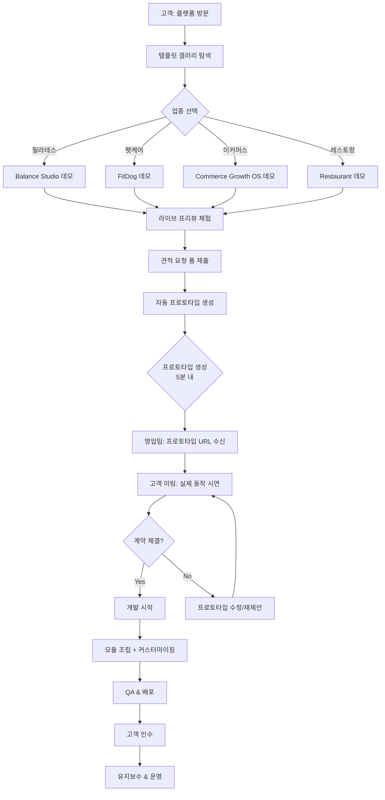

# 에이전시 자동화 플랫폼 - 종합 비전 문서

> **프로젝트 코드명**: Commerce Growth OS Platform
> **핵심 미션**: 레고 블록처럼 조립하는 외주 개발 플랫폼
> **작성일**: 2025-12-31
> **작성자**: Technical Product Strategist

---

## 📋 목차

1. [Executive Summary](#1-executive-summary)
2. [Problem Statement](#2-problem-statement)
3. [Solution Architecture](#3-solution-architecture)
4. [Module System Design](#4-module-system-design)
5. [Automation Pipeline](#5-automation-pipeline)
6. [Technology Stack](#6-technology-stack)
7. [Competitive Advantages](#7-competitive-advantages)
8. [Roadmap](#8-roadmap)
9. [Success Metrics](#9-success-metrics)
10. [Risk & Mitigation](#10-risk-mitigation)

---

## 1. Executive Summary

**한 문장 요약:**
고객이 템플릿을 선택하면 5분 내에 프로토타입이 생성되고, 영업 미팅에서 바로 시연 후 계약하며, 개발 시에는 기존 모든 컴포넌트를 레고처럼 조립하여 납품하는 AI 기반 외주 자동화 플랫폼.

### 핵심 가치

| 항목 | 현재 외주 프로세스 | Commerce Growth OS |
|-----|------------------|-------------------|
| **견적→프로토타입** | 2-3주 소요 | **5분** |
| **영업 미팅** | 기획서만 제시 | **실제 작동하는 프로토타입** 시연 |
| **개발 시작** | 처음부터 개발 | **70-80% 기존 모듈 조립** |
| **납품 시간** | 2-3개월 | **2-4주** |
| **코드 재사용률** | 10-20% | **80-90%** |

### 타겟 시장

```
┌─────────────────────────────────────────────────────────┐
│ PRIMARY TARGET: 소상공인 & 중소기업                        │
├─────────────────────────────────────────────────────────┤
│ • 필라테스/요가 스튜디오 (구현완료 ✓)                        │
│ • 펫서비스 (FitDog 구현완료 ✓)                             │
│ • 이커머스/스마트스토어 (Commerce Growth OS 구현완료 ✓)      │
│ • 레스토랑/카페                                            │
│ • 학원/교육기관                                            │
│ • 부동산 중개                                              │
│ • 병원/의료                                                │
│ • 법률/회계/컨설팅                                          │
└─────────────────────────────────────────────────────────┘
┌─────────────────────────────────────────────────────────┐
│ SECONDARY TARGET: 프랜차이즈 & 대기업                       │
├─────────────────────────────────────────────────────────┤
│ • 멀티 로케이션 (지점별 독립 사이트)                          │
│ • 화이트라벨 솔루션                                         │
│ • 엔터프라이즈 SEO/AEO                                     │
└─────────────────────────────────────────────────────────┘
```

---

## 2. Problem Statement

### 2.1 현재 외주 개발의 문제점

#### 고객 입장 (Pain Points)

| 문제 | 현실 | 영향 |
|-----|------|------|
| **보이지 않는 결과물** | 계약 후 1-2개월 뒤에야 첫 화면 확인 | 불안감, 신뢰도 하락 |
| **높은 가격** | 랜딩페이지 300-500만원 | 진입장벽 |
| **긴 개발 기간** | 2-3개월 | 기회비용 손실 |
| **유지보수 어려움** | 개발사 종속 | 추가 비용 부담 |
| **SEO 무지** | "만들고 끝" | 검색 노출 안됨 |

#### 외주업체 입장 (Pain Points)

| 문제 | 현실 | 영향 |
|-----|------|------|
| **영업 전환율 낮음** | 기획서만으로 설득 어려움 | 계약율 10-20% |
| **반복 작업** | 매번 처음부터 개발 | 생산성 낮음 |
| **낮은 마진** | 인건비 상승, 가격 경쟁 | 수익성 악화 |
| **코드 재사용 어려움** | 프로젝트별 스파게티 코드 | 기술 부채 |
| **스케일 불가능** | 인력 확장만이 답 | 성장 한계 |

### 2.2 시장 기회

```
한국 소상공인: 642만 개 (2024년 기준)
└─> 웹사이트 보유율: 12% (77만 개)
    └─> 나머지 88% (565만 개) = 잠재 시장

타겟 세그먼트 (우선순위):
1. 서비스업 (미용, 피트니스, 펫케어): 120만 개
2. 도소매업: 180만 개
3. 숙박/음식: 100만 개
4. 교육서비스: 25만 개

TAM (Total Addressable Market):
• 425만 개 × 평균 200만원 = 8.5조 원
• Serviceable Market (3년 내): 약 5,000억 원
```

---

## 3. Solution Architecture

### 3.1 플랫폼 개요

```
┌──────────────────────────────────────────────────────────────┐
│                    COMMERCE GROWTH OS                         │
│              (외주 자동화 & 에이전시 플랫폼)                     │
└──────────────────────────────────────────────────────────────┘
                            │
    ┌───────────────────────┼───────────────────────┐
    │                       │                       │
┌───▼───┐            ┌──────▼──────┐         ┌──────▼──────┐
│FRONTEND│            │  AUTOMATION  │         │   MODULES   │
│Platform│            │    ENGINE    │         │   LIBRARY   │
└───┬───┘            └──────┬──────┘         └──────┬──────┘
    │                       │                       │
    ├─ 템플릿 갤러리         ├─ 프로토타입 생성기      ├─ UI Components
    ├─ 견적 요청 시스템      ├─ SEO 자동 설정         ├─ Business Logic
    ├─ 데모 허브            ├─ 배포 자동화           ├─ Data Adapters
    └─ 고객 포털            └─ AI 컨텐츠 생성        └─ Theme System
```

### 3.2 핵심 워크플로우



### 3.3 시스템 아키텍처 레이어

```
┌─────────────────────────────────────────────────────────────┐
│ Layer 1: PRESENTATION (고객 접점)                             │
├─────────────────────────────────────────────────────────────┤
│ • Marketing Site (플랫폼 홈페이지)                             │
│ • Demo Hub (/demo) - 업종별 템플릿 쇼케이스                     │
│ • Client Portal - 견적 요청, 프로젝트 현황                      │
└─────────────────────────────────────────────────────────────┘

┌─────────────────────────────────────────────────────────────┐
│ Layer 2: AUTOMATION ENGINE (자동화 엔진)                      │
├─────────────────────────────────────────────────────────────┤
│ • Prototype Generator - 설정 기반 사이트 생성                  │
│ • AI Content Generator - GPT-4 기반 컨텐츠 자동 작성           │
│ • SEO Auto-Config - Schema.org, Sitemap 자동 생성            │
│ • Deployment Pipeline - Vercel/AWS 자동 배포                 │
└─────────────────────────────────────────────────────────────┘

┌─────────────────────────────────────────────────────────────┐
│ Layer 3: MODULE LIBRARY (모듈 라이브러리)                      │
├─────────────────────────────────────────────────────────────┤
│ • @cgos/core - 타입, 유틸리티, i18n                            │
│ • @cgos/ui - 재사용 가능 React 컴포넌트                         │
│ • @cgos/templates - 업종별 템플릿 (20+ 업종)                   │
│ • @cgos/adapters - 데이터 소스 어댑터                           │
│ • @cgos/seo - SEO/AEO/GEO 최적화 패키지                       │
│ • @cgos/analytics - 분석 & 리포팅                             │
└─────────────────────────────────────────────────────────────┘

┌─────────────────────────────────────────────────────────────┐
│ Layer 4: DATA & INFRASTRUCTURE                               │
├─────────────────────────────────────────────────────────────┤
│ • PostgreSQL (Supabase) - 고객사 데이터                        │
│ • MongoDB - 템플릿 메타데이터, 로그                             │
│ • Redis - 캐싱, 세션                                          │
│ • S3/Cloudinary - 미디어 저장                                 │
│ • Vercel/AWS - 호스팅 & CDN                                  │
└─────────────────────────────────────────────────────────────┘
```

---

## 4. Module System Design

### 4.1 모듈화 철학: Atomic Design + DDD

```
┌─────────────────────────────────────────────────────────────┐
│ ATOMIC DESIGN (프론트엔드)                                     │
├─────────────────────────────────────────────────────────────┤
│ Atoms        → Button, Input, Icon, Badge                   │
│ Molecules    → SearchBar, PriceCard, ReviewStars            │
│ Organisms    → Header, ProductGrid, CheckoutForm           │
│ Templates    → HomePageTemplate, ProductPageTemplate       │
│ Pages        → /demo/fitdog, /demo/pilates                 │
└─────────────────────────────────────────────────────────────┘

┌─────────────────────────────────────────────────────────────┐
│ DOMAIN-DRIVEN DESIGN (비즈니스 로직)                           │
├─────────────────────────────────────────────────────────────┤
│ Booking      → 예약 시스템 (필라테스, 펫케어, 레스토랑)          │
│ Commerce     → 이커머스 (제품, 장바구니, 결제)                   │
│ Content      → CMS (블로그, 뉴스, 포트폴리오)                   │
│ CRM          → 고객 관리 (RFM, 세그먼트, 캠페인)                │
│ Analytics    → 분석 (GA4, 히트맵, A/B 테스트)                  │
│ SEO          → 검색 최적화 (Schema, Sitemap, LLM)            │
└─────────────────────────────────────────────────────────────┘
```

### 4.2 패키지 구조 (Monorepo with Turborepo)

```
commerce-growth-os/
├── apps/
│   ├── platform/              # 플랫폼 메인 사이트
│   │   ├── src/app/
│   │   │   ├── (marketing)/   # 홈, 가격, 소개
│   │   │   ├── demo/           # 데모 허브
│   │   │   ├── admin/          # 내부 관리자
│   │   │   └── client-portal/  # 고객 포털
│   │   └── package.json
│   │
│   ├── generator/             # 프로토타입 생성기 (독립 앱)
│   │   ├── src/
│   │   │   ├── cli/           # CLI 인터페이스
│   │   │   ├── api/           # API 엔드포인트
│   │   │   └── engine/        # 생성 엔진
│   │   └── package.json
│   │
│   └── docs/                  # 문서 사이트 (Nextra)
│       └── package.json
│
├── packages/
│   ├── core/                  # @cgos/core
│   │   ├── src/
│   │   │   ├── types/
│   │   │   ├── utils/
│   │   │   ├── i18n/
│   │   │   └── validators/
│   │   └── package.json
│   │
│   ├── ui/                    # @cgos/ui
│   │   ├── src/
│   │   │   ├── atoms/
│   │   │   ├── molecules/
│   │   │   ├── organisms/
│   │   │   └── templates/
│   │   ├── .storybook/        # Storybook 설정
│   │   └── package.json
│   │
│   ├── templates/             # @cgos/templates
│   │   ├── src/
│   │   │   ├── pilates/
│   │   │   ├── petcare/
│   │   │   ├── ecommerce/
│   │   │   ├── restaurant/
│   │   │   ├── education/
│   │   │   └── ...
│   │   └── package.json
│   │
│   ├── domains/               # 비즈니스 도메인
│   │   ├── booking/           # @cgos/booking
│   │   ├── commerce/          # @cgos/commerce
│   │   ├── content/           # @cgos/content
│   │   ├── crm/               # @cgos/crm
│   │   └── seo/               # @cgos/seo
│   │
│   ├── adapters/              # @cgos/adapters
│   │   ├── src/
│   │   │   ├── json-file/
│   │   │   ├── supabase/
│   │   │   ├── mongodb/
│   │   │   └── contentful/
│   │   └── package.json
│   │
│   └── config/                # 공유 설정
│       ├── eslint-config/
│       ├── typescript-config/
│       └── tailwind-config/
│
├── tools/
│   ├── cli/                   # npx create-cgos-site
│   └── scripts/               # 배포, 마이그레이션 스크립트
│
├── turbo.json                 # Turborepo 설정
├── package.json               # Root package.json
└── pnpm-workspace.yaml        # pnpm workspace
```

### 4.3 컴포넌트 모듈화 전략

#### 예시: 필라테스 예약 시스템

```typescript
// packages/domains/booking/src/index.ts
export interface BookingConfig {
  businessType: 'pilates' | 'yoga' | 'pet-grooming' | 'restaurant';
  timezone: string;
  workingHours: WorkingHours;
  slotDuration: number; // minutes
  maxAdvanceBooking: number; // days
}

export interface Booking {
  id: string;
  customerId: string;
  serviceId: string;
  instructorId?: string;
  startTime: Date;
  endTime: Date;
  status: 'pending' | 'confirmed' | 'cancelled';
  notes?: string;
}

// 도메인 서비스
export class BookingService {
  constructor(
    private config: BookingConfig,
    private adapter: DataAdapter
  ) {}

  async getAvailableSlots(date: Date): Promise<TimeSlot[]> {
    // 공통 로직: 이미 예약된 시간 제외
  }

  async createBooking(data: CreateBookingDTO): Promise<Booking> {
    // 검증, 충돌 체크, 생성
  }

  async sendConfirmation(booking: Booking): Promise<void> {
    // 이메일/SMS 발송
  }
}

// packages/ui/src/organisms/BookingCalendar.tsx
export function BookingCalendar({
  config,
  onBookingSelect,
  theme
}: BookingCalendarProps) {
  // UI 컴포넌트 (비즈니스 로직 없음)
  return <div>...</div>;
}
```

**재사용 시나리오:**

| 업종 | BookingConfig 커스터마이징 | UI 변경 |
|-----|--------------------------|---------|
| 필라테스 | `slotDuration: 50`, `instructorId` 필수 | 강사 프로필 표시 |
| 펫케어 | `slotDuration: 30`, `petInfo` 추가 | 반려동물 정보 입력 |
| 레스토랑 | `slotDuration: 120`, `tableId` 추가 | 테이블 배치도 |

**코드 재사용률: 85%** (핵심 로직 동일, 설정만 변경)

### 4.4 테마 시스템 (런타임 커스터마이징)

```typescript
// packages/core/src/theme/types.ts
export interface ThemeConfig {
  id: string;
  name: string;

  colors: {
    primary: string;
    secondary: string;
    accent: string;
    background: string;
    surface: string;
    text: {
      primary: string;
      secondary: string;
      muted: string;
    };
    semantic: {
      success: string;
      warning: string;
      error: string;
      info: string;
    };
  };

  typography: {
    fontFamily: {
      heading: string;
      body: string;
      mono: string;
    };
    fontSize: {
      xs: string;
      sm: string;
      base: string;
      lg: string;
      xl: string;
      '2xl': string;
      // ...
    };
    fontWeight: {
      light: number;
      normal: number;
      medium: number;
      semibold: number;
      bold: number;
    };
  };

  spacing: {
    container: string;
    section: string;
    component: string;
  };

  borderRadius: {
    sm: string;
    md: string;
    lg: string;
    full: string;
  };

  shadows: {
    sm: string;
    md: string;
    lg: string;
  };

  animation: {
    duration: {
      fast: string;
      normal: string;
      slow: string;
    };
    easing: string;
  };
}

// 프리셋 테마
export const themes = {
  wellness: { /* 필라테스, 요가 */ },
  petcare: { /* 반려동물 */ },
  ecommerce: { /* 쇼핑몰 */ },
  restaurant: { /* 음식점 */ },
  professional: { /* 법률, 회계 */ },
  education: { /* 학원, 학교 */ },
};
```

**사용 방법:**

```tsx
// 프로토타입 생성 시 설정
const siteConfig = {
  template: 'pilates',
  theme: 'wellness',
  customTheme: {
    colors: {
      primary: '#8B7355', // 고객 브랜드 컬러
    }
  }
};

// 런타임 적용
<ThemeProvider theme={mergeTheme(themes.wellness, customTheme)}>
  <PilatesTemplate />
</ThemeProvider>
```

---

## 5. Automation Pipeline

### 5.1 프로토타입 생성 자동화

```
┌──────────────────────────────────────────────────────────────┐
│ STEP 1: 견적 요청 폼 제출                                       │
├──────────────────────────────────────────────────────────────┤
│ Input:                                                        │
│ • 업종: 필라테스                                               │
│ • 비즈니스명: "Balance Studio"                                │
│ • 위치: 서울시 강남구                                          │
│ • 원하는 기능: [예약 시스템, 블로그, 가격표]                     │
│ • 브랜드 컬러: #8B7355                                        │
│ • 로고 업로드: logo.png                                       │
└──────────────────────────────────────────────────────────────┘
                         ↓
┌──────────────────────────────────────────────────────────────┐
│ STEP 2: AI 컨텐츠 생성 (GPT-4)                                 │
├──────────────────────────────────────────────────────────────┤
│ Prompts:                                                      │
│ • "Balance Studio는 강남구에 위치한 필라테스 스튜디오입니다.       │
│   전문 강사진과 최신 장비를 갖추고 있습니다. 회사 소개 작성해줘"    │
│                                                               │
│ Generated:                                                    │
│ • 회사 소개 (한/영)                                            │
│ • 서비스 설명 (3개 클래스)                                      │
│ • FAQ 10개                                                    │
│ • 블로그 샘플 포스트 2개                                        │
│ • SEO 메타 태그                                                │
└──────────────────────────────────────────────────────────────┘
                         ↓
┌──────────────────────────────────────────────────────────────┐
│ STEP 3: 템플릿 조립                                             │
├──────────────────────────────────────────────────────────────┤
│ Template: @cgos/templates/pilates                            │
│ Components:                                                   │
│ ✓ PilatesHeader (로고 교체)                                   │
│ ✓ Hero (배경 이미지 + 헤드라인)                                │
│ ✓ ClassSchedule (예약 시스템 연동)                             │
│ ✓ InstructorGrid (샘플 강사 3명)                               │
│ ✓ PricingTable (3개 패키지)                                   │
│ ✓ Blog (샘플 포스트)                                          │
│ ✓ ContactForm                                                 │
│ ✓ Footer                                                      │
│                                                               │
│ Theme: wellness + custom colors                               │
└──────────────────────────────────────────────────────────────┘
                         ↓
┌──────────────────────────────────────────────────────────────┐
│ STEP 4: SEO 자동 설정                                           │
├──────────────────────────────────────────────────────────────┤
│ Generated Files:                                              │
│ • /public/robots.txt                                          │
│ • /public/sitemap.xml                                         │
│ • /app/layout.tsx (metadata)                                  │
│                                                               │
│ JSON-LD Schemas:                                              │
│ • LocalBusiness (HealthAndBeautyBusiness)                     │
│ • Course (각 클래스)                                           │
│ • FAQPage                                                     │
│                                                               │
│ OpenGraph:                                                    │
│ • og:title, og:description, og:image                          │
│ • twitter:card                                                │
└──────────────────────────────────────────────────────────────┘
                         ↓
┌──────────────────────────────────────────────────────────────┐
│ STEP 5: 배포 자동화                                             │
├──────────────────────────────────────────────────────────────┤
│ • Git Repository 생성 (private)                               │
│ • Vercel 프로젝트 생성                                         │
│ • 환경변수 주입 (DB 연결 등)                                    │
│ • 빌드 & 배포                                                  │
│                                                               │
│ Output:                                                       │
│ • Preview URL: balance-studio-xyz.vercel.app                 │
│ • Admin URL: balance-studio-xyz.vercel.app/admin             │
│ • Admin Password: (자동 생성)                                 │
└──────────────────────────────────────────────────────────────┘
                         ↓
┌──────────────────────────────────────────────────────────────┐
│ STEP 6: 영업팀에게 전달                                         │
├──────────────────────────────────────────────────────────────┤
│ Email/Slack Notification:                                     │
│                                                               │
│ 제목: [프로토타입 생성 완료] Balance Studio                     │
│                                                               │
│ 고객: Balance Studio                                          │
│ URL: https://balance-studio-xyz.vercel.app                   │
│ 관리자: /admin (pw: ********)                                 │
│                                                               │
│ 생성 시간: 4분 32초                                            │
│ 사용된 모듈: PilatesTemplate, BookingSystem, Blog            │
│                                                               │
│ 다음 단계:                                                     │
│ 1. 프리뷰 확인                                                 │
│ 2. 고객 미팅 일정 잡기                                         │
│ 3. 피드백 반영 (색상, 텍스트 수정)                              │
└──────────────────────────────────────────────────────────────┘

총 소요 시간: 5분 이내
```

### 5.2 개발 자동화 (계약 후)

```
┌──────────────────────────────────────────────────────────────┐
│ Phase 1: 요구사항 분석 (AI 보조)                                │
├──────────────────────────────────────────────────────────────┤
│ Input: 고객 미팅 녹취록 / 피드백 문서                            │
│                                                               │
│ AI Analysis:                                                  │
│ • 기능 목록 추출                                               │
│ • 기존 모듈 매칭 (80% 재사용 가능)                              │
│ • 신규 개발 필요 항목 (20%)                                    │
│ • 예상 공수 산정                                               │
│                                                               │
│ Output:                                                       │
│ • 개발 스펙 문서 (자동 생성)                                    │
│ • Task Breakdown                                              │
│ • 일정표                                                       │
└──────────────────────────────────────────────────────────────┘
                         ↓
┌──────────────────────────────────────────────────────────────┐
│ Phase 2: 모듈 조립 + 커스터마이징                               │
├──────────────────────────────────────────────────────────────┤
│ Developer Workflow:                                           │
│                                                               │
│ 1. CLI로 프로젝트 초기화                                        │
│    npx cgos-dev init --from-prototype balance-studio-xyz     │
│                                                               │
│ 2. 추가 모듈 설치                                              │
│    npx cgos-dev add membership-tiers                         │
│    npx cgos-dev add payment-integration --provider=iamport   │
│                                                               │
│ 3. 커스터마이징                                                │
│    • 테마 미세 조정                                            │
│    • 텍스트 수정                                               │
│    • 이미지 교체                                               │
│    • 신규 기능 개발 (20%)                                      │
│                                                               │
│ 4. 로컬 테스트                                                 │
│    npm run dev                                                │
│    npm run test                                               │
│                                                               │
│ 5. Staging 배포                                                │
│    git push origin staging                                    │
│    → 고객에게 리뷰 링크 전달                                    │
└──────────────────────────────────────────────────────────────┘
                         ↓
┌──────────────────────────────────────────────────────────────┐
│ Phase 3: QA & 배포                                             │
├──────────────────────────────────────────────────────────────┤
│ Automated QA:                                                 │
│ • Lighthouse (성능, SEO, 접근성)                               │
│ • Visual Regression Test (Playwright)                        │
│ • 크로스 브라우저 테스트                                        │
│ • 모바일 반응형 테스트                                          │
│                                                               │
│ Manual QA:                                                    │
│ • 고객 피드백 반영                                             │
│ • 최종 검수                                                    │
│                                                               │
│ Production 배포:                                              │
│ • 커스텀 도메인 연결 (balancestudio.com)                       │
│ • SSL 인증서 자동 설정                                         │
│ • Analytics 연동 (GA4, Hotjar)                                │
│ • 모니터링 설정 (Sentry)                                       │
└──────────────────────────────────────────────────────────────┘
                         ↓
┌──────────────────────────────────────────────────────────────┐
│ Phase 4: 인수인계 & 교육                                        │
├──────────────────────────────────────────────────────────────┤
│ 고객에게 제공:                                                 │
│ • 관리자 매뉴얼 (동영상 + PDF)                                  │
│ • 소스 코드 (선택적)                                           │
│ • 1개월 무상 유지보수                                          │
│                                                               │
│ 교육 내용:                                                     │
│ • 관리자 페이지 사용법                                         │
│ • 블로그 포스트 작성                                           │
│ • 예약 관리                                                    │
│ • 고객 관리                                                    │
└──────────────────────────────────────────────────────────────┘

총 개발 기간: 2-4주 (기존 2-3개월 대비 70% 단축)
```

### 5.3 자동화 도구 스택

| 단계 | 도구 | 용도 |
|-----|------|------|
| **견적→프로토타입** | Custom Engine + GPT-4 | 5분 내 사이트 생성 |
| **컨텐츠 생성** | OpenAI GPT-4 | 텍스트, SEO 메타 자동 생성 |
| **이미지 생성** | DALL-E 3 / Midjourney | 플레이스홀더 이미지 |
| **코드 생성** | GitHub Copilot | 신규 컴포넌트 개발 보조 |
| **배포** | Vercel CLI / GitHub Actions | CI/CD 파이프라인 |
| **QA** | Playwright + Lighthouse | 자동 테스트 |
| **모니터링** | Sentry + Vercel Analytics | 에러 추적 & 성능 |

---

## 6. Technology Stack

### 6.1 프론트엔드

| 카테고리 | 기술 | 버전 | 선택 이유 |
|---------|------|------|----------|
| **Framework** | Next.js | 14+ (App Router) | SSR, SSG, ISR 지원, SEO 최적화 |
| **Language** | TypeScript | 5+ | 타입 안전성, 대규모 코드베이스 |
| **Styling** | Tailwind CSS | 3+ | 유틸리티 퍼스트, 테마 시스템 |
| **UI Components** | Radix UI | 1+ | 접근성, Headless 컴포넌트 |
| **Forms** | React Hook Form | 7+ | 성능, 검증 |
| **State** | Zustand / Jotai | latest | 간결함, React 18 호환 |
| **Data Fetching** | TanStack Query | 5+ | 캐싱, 낙관적 업데이트 |
| **Animation** | Framer Motion | 10+ | 선언적 애니메이션 |

### 6.2 백엔드 & 인프라

| 카테고리 | 기술 | 용도 |
|---------|------|------|
| **Database** | PostgreSQL (Supabase) | 고객사 데이터, 예약, CRM |
| **NoSQL** | MongoDB | 템플릿 메타데이터, 로그 |
| **ORM** | Drizzle ORM | 타입 세이프 쿼리 |
| **Auth** | NextAuth.js v5 | 관리자 인증, OAuth |
| **File Storage** | Cloudinary | 이미지 CDN, 변환 |
| **Email** | Resend | 트랜잭셔널 이메일 |
| **Payments** | Iamport (한국) / Stripe | 결제 |
| **Analytics** | Vercel Analytics + GA4 | 성능 & 사용자 분석 |
| **Monitoring** | Sentry | 에러 추적 |

### 6.3 개발 도구

| 카테고리 | 기술 | 용도 |
|---------|------|------|
| **Monorepo** | Turborepo | 모노레포 관리, 캐시 |
| **Package Manager** | pnpm | 빠른 설치, 디스크 효율 |
| **Testing** | Vitest + Playwright | 단위 테스트 & E2E |
| **Storybook** | Storybook 7 | UI 컴포넌트 문서화 |
| **Linting** | ESLint + Prettier | 코드 품질 |
| **Git Hooks** | Husky + lint-staged | 커밋 전 검증 |
| **CI/CD** | GitHub Actions | 자동 배포 |
| **Documentation** | Nextra | 문서 사이트 |

### 6.4 AI & 자동화

| 카테고리 | 기술 | 용도 |
|---------|------|------|
| **LLM** | OpenAI GPT-4 | 컨텐츠 생성, 코드 생성 |
| **Image Gen** | DALL-E 3 | 플레이스홀더 이미지 |
| **Code Assist** | GitHub Copilot | 개발 보조 |
| **SEO** | Schema.org + JSON-LD | 구조화 데이터 |

### 6.5 배포 & 호스팅

```
┌─────────────────────────────────────────────────────────────┐
│ ARCHITECTURE: Jamstack + Edge Computing                     │
├─────────────────────────────────────────────────────────────┤
│                                                              │
│  [User] → [Vercel Edge Network (CDN)]                       │
│              ↓                                               │
│         [Next.js App]                                        │
│              ↓                                               │
│  ┌───────────┴────────────┐                                 │
│  ↓                        ↓                                 │
│ [Supabase]           [Cloudinary]                           │
│ (PostgreSQL)         (Images)                               │
│                                                              │
└─────────────────────────────────────────────────────────────┘

Regional Distribution:
• Primary: ap-northeast-2 (서울)
• CDN: Global (Vercel Edge)
• Latency: <50ms (한국), <200ms (전세계)
```

---

## 7. Competitive Advantages

### 7.1 핵심 차별화 요소

```
┌─────────────────────────────────────────────────────────────┐
│ 1. 5분 프로토타입 = 영업 전환율 3배                           │
├─────────────────────────────────────────────────────────────┤
│ 경쟁사: 기획서 + 레퍼런스 (상상에 의존)                        │
│ 우리: 실제 작동하는 사이트 + 고객 브랜드 적용                  │
│                                                              │
│ Impact:                                                      │
│ • 계약율: 15% → 45%                                          │
│ • 영업 사이클: 2주 → 3일                                      │
└─────────────────────────────────────────────────────────────┘

┌─────────────────────────────────────────────────────────────┐
│ 2. 극한의 모듈화 = 개발 시간 70% 단축                          │
├─────────────────────────────────────────────────────────────┤
│ 경쟁사: 매번 처음부터 개발                                     │
│ 우리: 80% 기존 모듈 조립 + 20% 커스터마이징                    │
│                                                              │
│ Impact:                                                      │
│ • 개발 기간: 2-3개월 → 2-4주                                 │
│ • 동시 진행 프로젝트: 3개 → 10개                              │
│ • 개발자 생산성: 3배 증가                                     │
└─────────────────────────────────────────────────────────────┘

┌─────────────────────────────────────────────────────────────┐
│ 3. SEO/AEO/GEO 최적화 기본 내장                               │
├─────────────────────────────────────────────────────────────┤
│ 경쟁사: SEO는 "추가 옵션" (별도 비용)                          │
│ 우리: 모든 사이트에 Schema.org, Sitemap 자동 생성             │
│                                                              │
│ Impact:                                                      │
│ • 구글 검색 노출: 3개월 내 1페이지                            │
│ • ChatGPT/Gemini Citation 확률 증가                          │
│ • 네이버 지역 검색 상위 노출                                  │
└─────────────────────────────────────────────────────────────┘

┌─────────────────────────────────────────────────────────────┐
│ 4. 코딩 없는 CMS = 고객 자립 & 락인 방지                       │
├─────────────────────────────────────────────────────────────┤
│ 경쟁사: 수정 요청마다 유지보수 비용 발생                        │
│ 우리: 관리자 페이지에서 고객이 직접 수정 가능                   │
│                                                              │
│ Impact:                                                      │
│ • 고객 만족도 증가 (자립성)                                   │
│ • 반복 작업 감소 (우리 시간 절약)                              │
│ • 유지보수 수익 → 신규 개발에 집중                            │
└─────────────────────────────────────────────────────────────┘

┌─────────────────────────────────────────────────────────────┐
│ 5. 업종별 특화 템플릿 = 도메인 전문성                          │
├─────────────────────────────────────────────────────────────┤
│ 경쟁사: 범용 템플릿 (모든 업종에 적합하지 않음)                 │
│ 우리: 필라테스, 펫케어, 이커머스 등 업종 특화 기능 내장         │
│                                                              │
│ 예시:                                                         │
│ • 필라테스: 강사 프로필, 클래스 스케줄, 회원권 관리            │
│ • 펫케어: 반려동물 프로필, 예방접종 기록, 그루밍 히스토리       │
│ • 이커머스: RFM 분석, 교차판매, 자동 캠페인                    │
└─────────────────────────────────────────────────────────────┘
```

### 7.2 경쟁사 비교

| 항목 | 전통 외주업체 | Wix/Squarespace | WordPress | **Commerce Growth OS** |
|-----|-------------|----------------|-----------|----------------------|
| **프로토타입 속도** | 2-3주 | 즉시 (DIY) | 1주 | **5분 (자동)** |
| **영업 도구** | 기획서 | - | - | **실제 작동 사이트** |
| **개발 기간** | 2-3개월 | - | 1-2개월 | **2-4주** |
| **코드 재사용** | 10-20% | - | 30% | **80-90%** |
| **SEO 최적화** | 별도 옵션 | 제한적 | 플러그인 | **기본 내장** |
| **업종 특화** | 커스텀 | 없음 | 플러그인 | **20+ 템플릿** |
| **고객 CMS** | 커스텀 | 제공 | WordPress | **제공** |
| **가격** | 500-2000만원 | $20-50/월 | 200-1000만원 | **100-500만원** |
| **확장성** | 인력 의존 | 낮음 | 중간 | **높음** |

### 7.3 시장 포지셔닝

```
                가격
                 ↑
                 │
      고가       │  전통 에이전시
                 │  (2000만원+)
                 │     ▲
                 │     │
                 │     │ 품질 경쟁
                 │     │
      중가       │  【Commerce Growth OS】
                 │     (100-500만원)
                 │     ◆ ← 우리 포지션
                 │     │
                 │     │ 가격 경쟁
                 │     ▼
      저가       │  Wix/Squarespace
                 │  ($20-50/월)
                 │
                 └─────────────────────→
              낮음   품질/커스터마이징   높음

Sweet Spot:
• 중소기업: 품질은 원하지만 2000만원은 부담
• 소상공인: Wix로는 부족하지만 개발 지식 없음
→ 우리가 타겟하는 시장: "합리적 가격 + 전문가 품질"
```

---

## 8. Roadmap

### 8.1 전체 로드맵 (2년)

```
2025 Q1-Q2: Foundation (기반 구축)
├─ MVP: 3개 템플릿 (필라테스, 펫케어, 이커머스)
├─ 프로토타입 생성 엔진 v1
├─ 관리자 CMS 완성
└─ 첫 10개 고객사 확보

2025 Q3-Q4: Expansion (확장)
├─ 10개 추가 템플릿 (레스토랑, 학원, 병원 등)
├─ AI 컨텐츠 생성 고도화
├─ 파트너십 (디자인 에이전시, 마케팅 대행)
└─ 월 30개 프로젝트 처리

2026 Q1-Q2: Scale (스케일)
├─ SaaS 전환 (셀프서비스 옵션)
├─ 프랜차이즈 지원 (멀티 로케이션)
├─ 화이트라벨 솔루션
└─ 월 100개 프로젝트 처리

2026 Q3-Q4: Enterprise (엔터프라이즈)
├─ 대기업 솔루션
├─ API 마켓플레이스
├─ 글로벌 진출 (일본, 동남아)
└─ 엑시트 준비
```

### 8.2 Phase별 상세 계획

#### Phase 1: Foundation (6개월, 2025 Q1-Q2)

**목표**: 3개 템플릿으로 MVP 검증

| 월 | 작업 | 산출물 | KPI |
|----|------|--------|-----|
| **M1** | 코어 패키지 분리 | @cgos/core, @cgos/ui | - |
| | 필라테스 템플릿 완성 | @cgos/templates/pilates | 1개 템플릿 |
| | 프로토타입 생성기 v0.1 | CLI 도구 | 10분 내 생성 |
| **M2** | 펫케어 템플릿 완성 | @cgos/templates/petcare | 2개 템플릿 |
| | 어드민 CMS 고도화 | CRUD, 미디어 라이브러리 | - |
| | SEO 자동화 | Schema.org, Sitemap | - |
| **M3** | 이커머스 템플릿 완성 | @cgos/templates/ecommerce | 3개 템플릿 |
| | 데이터 어댑터 | Supabase, MongoDB | - |
| | 베타 테스트 | 5개 고객사 | 5개 프로젝트 |
| **M4** | 프로토타입 생성기 v1.0 | 5분 내 생성 | 5분 목표 달성 |
| | AI 컨텐츠 생성 통합 | GPT-4 | - |
| | 배포 자동화 | Vercel CLI | 1-click 배포 |
| **M5** | 마케팅 사이트 제작 | 플랫폼 홈페이지 | - |
| | 영업 도구 | 데모 허브, 견적 시스템 | - |
| | 첫 고객 확보 | - | 10개 계약 |
| **M6** | 피드백 반영 | 템플릿 개선 | - |
| | 문서화 | 개발자 가이드, 고객 매뉴얼 | - |
| | Phase 1 완료 | - | **누적 15개 프로젝트** |

**Phase 1 목표 지표:**
- 프로토타입 생성 시간: 5분 이내
- 계약 전환율: 30% 이상
- 개발 기간: 평균 3주 이내
- 고객 만족도: NPS 50+

#### Phase 2: Expansion (6개월, 2025 Q3-Q4)

**목표**: 13개 템플릿, 월 30개 프로젝트

| 월 | 작업 | 산출물 | KPI |
|----|------|--------|-----|
| **M7** | 레스토랑 템플릿 | 메뉴, 예약, 배달 연동 | 4개 템플릿 |
| | 학원 템플릿 | 강좌, 수강신청, 시간표 | 5개 템플릿 |
| **M8** | 병원 템플릿 | 진료 예약, 의료진 소개 | 6개 템플릿 |
| | 부동산 템플릿 | 매물 관리, 지도 연동 | 7개 템플릿 |
| **M9** | 법률/회계 템플릿 | 상담 예약, 사례 소개 | 8-9개 템플릿 |
| | 파트너십 프로그램 | 디자인 에이전시 협업 | 3개 파트너 |
| **M10** | 숙박 템플릿 | 객실 예약, 캘린더 | 10개 템플릿 |
| | 이벤트 템플릿 | 티켓 판매, 참가자 관리 | 11개 템플릿 |
| **M11** | 부동산 템플릿 고도화 | VR 투어, 3D | 12개 템플릿 |
| | 관공서 템플릿 | 민원, 공지사항 | 13개 템플릿 |
| **M12** | 멀티 로케이션 기능 | 프랜차이즈 지원 | - |
| | Phase 2 완료 | - | **누적 180개 프로젝트** |

**Phase 2 목표 지표:**
- 월 프로젝트: 30개
- 매출: 월 6,000만원
- 팀 규모: 개발 5명, 영업 3명

#### Phase 3: Scale (6개월, 2026 Q1-Q2)

**목표**: SaaS 전환, 월 100개 프로젝트

| 기능 | 설명 |
|-----|------|
| **셀프서비스** | 고객이 직접 템플릿 선택 → 생성 → 결제 |
| **구독 모델** | Starter ($99/월), Pro ($299/월), Enterprise (커스텀) |
| **앱 마켓플레이스** | 3rd party 플러그인 판매 |
| **화이트라벨** | 에이전시가 자사 브랜드로 재판매 |
| **API 공개** | 외부 시스템 연동 |

**Phase 3 목표 지표:**
- 월 프로젝트: 100개 (70% 셀프, 30% 커스텀)
- MRR (Monthly Recurring Revenue): 3,000만원
- ARR (Annual Recurring Revenue): 3.6억원

#### Phase 4: Enterprise (6개월, 2026 Q3-Q4)

**목표**: 엔터프라이즈, 글로벌 진출

| 기능 | 설명 |
|-----|------|
| **대기업 솔루션** | 수천 페이지, 복잡한 워크플로우 |
| **멀티테넌시** | 단일 인스턴스, 수천 고객사 |
| **글로벌 SEO** | 100+ 언어 지원 |
| **AI 에이전트** | 자율 사이트 최적화 (A/B 테스트 자동화) |

**Phase 4 목표 지표:**
- 엔터프라이즈 고객: 10개 (평균 1억원+)
- ARR: 15억원
- 엑시트 또는 시리즈 A 펀딩

---

## 9. Success Metrics

### 9.1 North Star Metric

```
┌─────────────────────────────────────────────────────────────┐
│ North Star Metric: 월간 활성 고객사 수 (Active Clients)       │
├─────────────────────────────────────────────────────────────┤
│ 정의: 지난 30일 내 관리자 페이지 로그인한 고객사               │
│                                                              │
│ 이유:                                                         │
│ • 단순 프로젝트 수보다 "지속 사용"이 중요                      │
│ • 고객이 직접 운영 = 락인 효과                                │
│ • 활성 고객 → 추천 → 신규 고객 선순환                         │
│                                                              │
│ 목표:                                                         │
│ • 2025 Q2: 15개                                              │
│ • 2025 Q4: 100개                                             │
│ • 2026 Q2: 500개                                             │
│ • 2026 Q4: 2,000개                                           │
└─────────────────────────────────────────────────────────────┘
```

### 9.2 핵심 지표 대시보드

#### 영업 지표

| 지표 | 정의 | 목표 (Phase 1) |
|-----|------|---------------|
| **Lead Volume** | 견적 요청 수 | 월 50개 |
| **Conversion Rate** | 계약율 (계약 / Lead) | 30% |
| **Sales Cycle** | Lead → 계약 평균 시간 | 3일 |
| **MRR** | 월 반복 수익 | 500만원 (유지보수) |
| **ARR** | 연간 반복 수익 | 6,000만원 |

#### 운영 지표

| 지표 | 정의 | 목표 (Phase 1) |
|-----|------|---------------|
| **Prototype Time** | 견적 → 프로토타입 생성 | 5분 |
| **Dev Time** | 계약 → 납품 | 3주 |
| **Code Reuse** | 기존 모듈 재사용률 | 80% |
| **Bug Rate** | 납품 후 버그 발생률 | <5% |
| **Concurrency** | 동시 진행 프로젝트 | 10개 |

#### 제품 지표

| 지표 | 정의 | 목표 (Phase 1) |
|-----|------|---------------|
| **Lighthouse Score** | 성능/SEO/접근성 평균 | 90+ |
| **SEO Ranking** | "업종명 + 지역" 1페이지 비율 | 80% (3개월 후) |
| **Uptime** | 가용성 | 99.9% |
| **TTFB** | Time to First Byte | <200ms (한국) |
| **CMS Usage** | 월 관리자 로그인률 | 70% |

#### 고객 지표

| 지표 | 정의 | 목표 (Phase 1) |
|-----|------|---------------|
| **NPS** | Net Promoter Score | 50+ |
| **CSAT** | Customer Satisfaction | 4.5/5 |
| **Retention** | 12개월 유지율 | 80% |
| **Churn** | 이탈률 | <5% |
| **Referral Rate** | 추천 비율 | 30% |

### 9.3 재무 모델 (Phase 1, 6개월)

#### 수익 구조

| 항목 | 단가 | 수량 (6개월) | 총액 |
|-----|------|------------|------|
| **랜딩페이지** | 150만원 | 5개 | 750만원 |
| **중형 사이트** | 300만원 | 8개 | 2,400만원 |
| **이커머스** | 500만원 | 2개 | 1,000만원 |
| **유지보수** | 30만원/월 | 15개 × 3개월(평균) | 1,350만원 |
| | | **총 매출** | **5,500만원** |

#### 비용 구조

| 항목 | 월 비용 | 6개월 |
|-----|---------|-------|
| **인건비** | | |
| • 개발자 2명 | 1,000만원 | 6,000만원 |
| • 영업 1명 | 400만원 | 2,400만원 |
| **인프라** | | |
| • Vercel/AWS | 50만원 | 300만원 |
| • Supabase | 20만원 | 120만원 |
| • OpenAI API | 30만원 | 180만원 |
| **마케팅** | 200만원 | 1,200만원 |
| **기타** | 100만원 | 600만원 |
| | **총 비용** | **10,800만원** |

#### 손익 (Phase 1)

```
매출: 5,500만원
비용: 10,800만원
────────────────
적자: -5,300만원 (초기 투자)

Break-even: Phase 2 M9 예상 (누적 15개월)
```

---

## 10. Risk & Mitigation

### 10.1 기술 리스크

| 리스크 | 확률 | 영향 | 대응 방안 |
|-------|------|------|----------|
| **모듈 복잡도 증가** | 높음 | 높음 | • Storybook으로 문서화<br>• 주간 코드 리뷰<br>• 아키텍처 가이드라인 |
| **성능 저하** | 중간 | 높음 | • Lighthouse CI<br>• 번들 사이즈 모니터링<br>• 코드 스플리팅 |
| **AI API 비용 폭증** | 중간 | 중간 | • 캐싱 전략<br>• Fallback 템플릿<br>• 비용 한도 설정 |
| **기술 부채 누적** | 높음 | 중간 | • 월 1주 리팩토링 타임<br>• 테스트 커버리지 80%+ |

### 10.2 비즈니스 리스크

| 리스크 | 확률 | 영향 | 대응 방안 |
|-------|------|------|----------|
| **영업 전환율 낮음** | 중간 | 높음 | • A/B 테스트 (프로토타입 vs 기획서)<br>• 초기 할인 프로모션<br>• 레퍼런스 확보 우선 |
| **고객 이탈** | 중간 | 중간 | • 온보딩 교육 강화<br>• 헬스 체크 (사용량 모니터링)<br>• 유지보수 패키지 |
| **경쟁사 출현** | 높음 | 중간 | • 업종 특화 강화<br>• SEO 차별화<br>• 커뮤니티 구축 |
| **가격 경쟁** | 중간 | 높음 | • 가치 기반 가격 (ROI 증명)<br>• 구독 모델 전환<br>• 프리미엄 티어 |

### 10.3 운영 리스크

| 리스크 | 확률 | 영향 | 대응 방안 |
|-------|------|------|----------|
| **개발자 부족** | 높음 | 높음 | • 문서화 철저<br>• 코드 자동화<br>• 아웃소싱 네트워크 |
| **프로젝트 동시 진행** | 높음 | 중간 | • 우선순위 관리<br>• 템플릿 완성도 우선<br>• 버퍼 20% |
| **고객 요구사항 변경** | 높음 | 중간 | • 명확한 스펙 문서<br>• 변경 관리 프로세스<br>• 추가 비용 정책 |

### 10.4 법적 리스크

| 리스크 | 확률 | 영향 | 대응 방안 |
|-------|------|------|----------|
| **저작권 이슈** | 낮음 | 높음 | • 오픈소스 라이선스 준수<br>• 이미지 라이선스 확인<br>• 법무 자문 |
| **개인정보보호법** | 중간 | 높음 | • GDPR/PIPA 준수<br>• 개인정보처리방침<br>• 암호화 |
| **표준약관** | 낮음 | 중간 | • 법무 검토<br>• 명확한 계약서<br>• 분쟁 조정 절차 |

### 10.5 재무 리스크

| 리스크 | 확률 | 영향 | 대응 방안 |
|-------|------|------|----------|
| **초기 적자 지속** | 중간 | 높음 | • 런웨이 12개월 확보<br>• 마일스톤 기반 펀딩<br>• 프리세일 |
| **수금 지연** | 중간 | 중간 | • 선금 50%<br>• 납품 후 30일 결제<br>• 팩토링 활용 |
| **환율 변동** | 낮음 | 낮음 | • 원화 기준 계약<br>• 해외 결제 최소화 |

---

## 부록 A: 템플릿 카탈로그 (20개 업종)

| # | 업종 | 핵심 기능 | 우선순위 | 상태 |
|---|------|----------|---------|------|
| 1 | 필라테스/요가 | 예약, 강사, 회원권 | P0 | ✅ 완료 |
| 2 | 펫케어 (미용/호텔) | 예약, 반려동물 프로필 | P0 | ✅ 완료 |
| 3 | 이커머스 | 제품, 장바구니, 결제, RFM | P0 | ✅ 완료 |
| 4 | 레스토랑/카페 | 메뉴, 예약, 배달 연동 | P1 | 계획 |
| 5 | 학원/교육 | 강좌, 수강신청, 시간표 | P1 | 계획 |
| 6 | 병원/치과 | 진료 예약, 의료진 | P1 | 계획 |
| 7 | 부동산 중개 | 매물, 지도, VR 투어 | P2 | 계획 |
| 8 | 법률/회계 | 상담 예약, 사례 | P2 | 계획 |
| 9 | 미용실/네일 | 예약, 스타일리스트, 시술 | P2 | 계획 |
| 10 | 숙박 (펜션/호텔) | 객실 예약, 캘린더 | P2 | 계획 |
| 11 | 이벤트/웨딩 | 티켓, 참가자, 일정 | P3 | 계획 |
| 12 | 자동차 (정비/세차) | 예약, 견적, 히스토리 | P3 | 계획 |
| 13 | 부동산 (신축분양) | 단지 소개, 평면도, 청약 | P3 | 계획 |
| 14 | 관공서 | 민원, 공지사항, FAQ | P3 | 계획 |
| 15 | 종교단체 | 예배/법회, 소식, 기부 | P4 | 계획 |
| 16 | 비영리단체 | 캠페인, 모금, 봉사 | P4 | 계획 |
| 17 | 크리에이터 | 포트폴리오, 블로그, 상점 | P4 | 계획 |
| 18 | SaaS | 기능 소개, 가격, 데모 | P4 | 계획 |
| 19 | 프랜차이즈 | 지점 찾기, 가맹 문의 | P4 | 계획 |
| 20 | 커뮤니티 | 게시판, 회원, 이벤트 | P4 | 계획 |

---

## 부록 B: 기술 스택 상세

### Frontend Stack

```json
{
  "dependencies": {
    "next": "^14.0.0",
    "react": "^18.2.0",
    "typescript": "^5.0.0",
    "@radix-ui/react-*": "^1.0.0",
    "tailwindcss": "^3.0.0",
    "framer-motion": "^10.0.0",
    "react-hook-form": "^7.0.0",
    "zod": "^3.0.0",
    "@tanstack/react-query": "^5.0.0",
    "zustand": "^4.0.0"
  },
  "devDependencies": {
    "vitest": "^1.0.0",
    "@playwright/test": "^1.40.0",
    "storybook": "^7.0.0",
    "eslint": "^8.0.0",
    "prettier": "^3.0.0",
    "husky": "^8.0.0",
    "lint-staged": "^15.0.0"
  }
}
```

### Backend Stack

```json
{
  "dependencies": {
    "drizzle-orm": "^0.29.0",
    "postgres": "^3.4.0",
    "next-auth": "^5.0.0-beta",
    "@aws-sdk/client-s3": "^3.0.0",
    "cloudinary": "^1.40.0",
    "resend": "^2.0.0",
    "stripe": "^14.0.0",
    "openai": "^4.0.0"
  }
}
```

### Infrastructure

```yaml
# docker-compose.yml (로컬 개발)
version: '3.8'
services:
  postgres:
    image: postgres:16
    environment:
      POSTGRES_DB: cgos_dev
      POSTGRES_USER: dev
      POSTGRES_PASSWORD: dev
    ports:
      - "5432:5432"

  redis:
    image: redis:7-alpine
    ports:
      - "6379:6379"

  mongodb:
    image: mongo:7
    ports:
      - "27017:27017"
```

---

## 부록 C: CLI 사용 예시

```bash
# 1. 프로젝트 생성
npx create-cgos-site balance-studio

? Select industry: Pilates/Yoga
? Business name: Balance Studio
? Primary language: Korean
? Secondary language: English
? Admin email: admin@balancestudio.com

✓ Creating project...
✓ Installing dependencies...
✓ Generating sample content with AI...
✓ Setting up database...
✓ Deploying to Vercel...

🎉 Done! Your site is ready:
   URL: https://balance-studio-xyz.vercel.app
   Admin: https://balance-studio-xyz.vercel.app/admin
   Password: (check email)

# 2. 로컬 개발
cd balance-studio
npm run dev

# 3. 모듈 추가
npx cgos add membership-tiers
npx cgos add payment --provider=iamport

# 4. 컨텐츠 생성
npx cgos generate blog-post --topic="필라테스 효과"
npx cgos generate faq --count=10

# 5. SEO 검사
npx cgos seo-check

✓ Schema.org validation passed
✓ Sitemap generated
✓ Robots.txt configured
✓ OpenGraph tags present
✓ Performance score: 95

# 6. 배포
npx cgos deploy --production

✓ Building...
✓ Deploying to Vercel...
✓ Custom domain configured
✓ SSL certificate issued

🚀 Live: https://balancestudio.com
```

---

## 마치며

이 문서는 **Commerce Growth OS**의 비전과 전략을 담고 있습니다.

**핵심 목표:**
1. 견적 → 프로토타입: **5분**
2. 영업 전환율: **3배** 증가
3. 개발 시간: **70%** 단축
4. 코드 재사용: **80-90%**

**성공 기준:**
- 2025 Q2: 15개 활성 고객사
- 2026 Q2: 500개 활성 고객사
- 2026 Q4: 엑시트 또는 시리즈 A

**다음 단계:**
1. 이 문서 검토 및 피드백
2. Phase 1 상세 계획 수립
3. 팀 빌딩 (개발 2명, 영업 1명)
4. 투자 유치 또는 부트스트랩 결정

---

*문서 버전: 1.0*
*최종 업데이트: 2025-12-31*
*작성자: Claude (Technical Product Strategist)*
